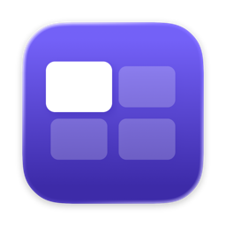
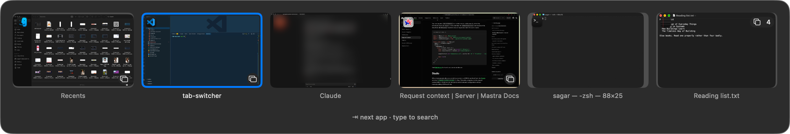
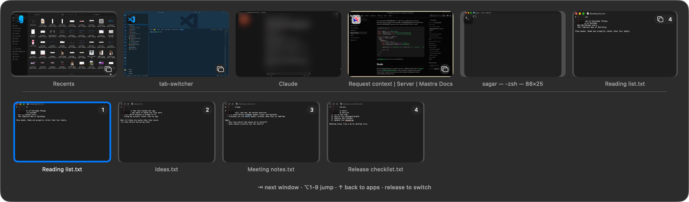
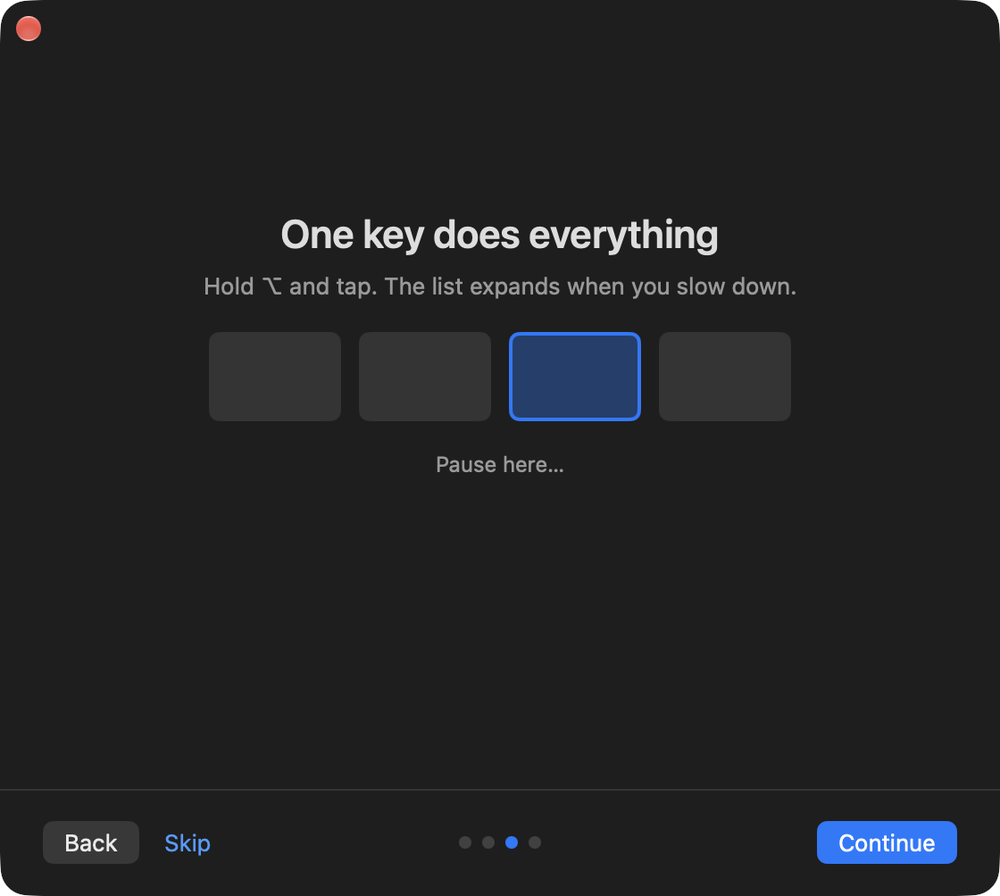
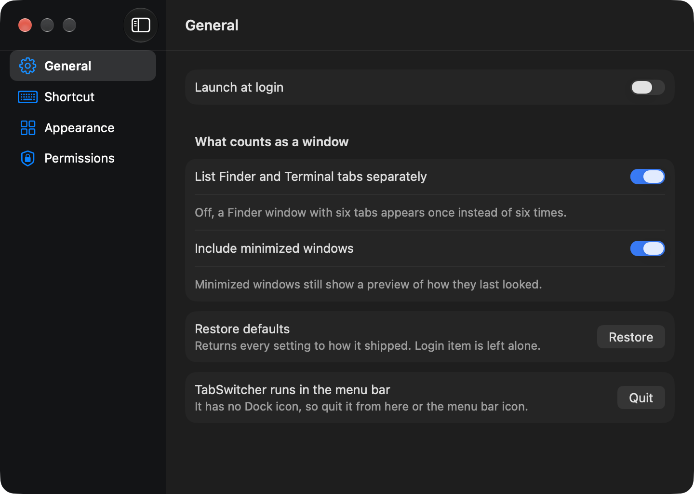

<div align="center">



# TabSwitcher

**A window switcher for macOS that shows you the windows.**

<kbd>⌥</kbd><kbd>Tab</kbd> cycles apps. Rest on one and its windows appear beneath it —
still on the same key.


</div>

<br>



## The problem

<kbd>⌘</kbd><kbd>Tab</kbd> shows icons. Icons tell you an app is open, not which of its
windows you want.

Open five VS Code windows and macOS offers you one entry. Pick it and you land on whichever
was frontmost last — which is rarely the one you were thinking of — and then you hunt
through Window menus or Mission Control, having already lost the thread.

Every window in that row above is a live preview. You choose by looking, not by remembering.

## Two levels, one key



Hold <kbd>⌥</kbd> and tap <kbd>Tab</kbd>: you move along the app row. Pause on an app that
has more than one window and its windows unfold underneath. Keep tapping <kbd>Tab</kbd> and
you are now moving through *those*.

The pause is the whole interaction. Move quickly and it behaves exactly like
<kbd>⌘</kbd><kbd>Tab</kbd>, so it never slows down the switch you already knew how to make.
Slow down and it gives you more. You never press a different key, and you never reach for
the arrows with your other hand.

If you would rather it never unfolded on its own, set the pause to **never** and use
<kbd>↓</kbd> or the mouse. If you would rather it were instant, set it to that.

### Every key

| | |
|---|---|
| <kbd>⌥</kbd><kbd>Tab</kbd> | next app — or next window, once the strip is open |
| <kbd>⌥</kbd><kbd>⇧</kbd><kbd>Tab</kbd> | backwards, at whichever level you are on |
| <kbd>⌥</kbd><kbd>1</kbd>…<kbd>9</kbd> | jump straight to a numbered window |
| <kbd>↓</kbd> | open the strip now, without waiting |
| <kbd>↑</kbd> | back up to the app row |
| <kbd>←</kbd> <kbd>→</kbd> | move within a row |
| type anything | filter every window on the machine by name |
| release <kbd>⌥</kbd>, or <kbd>↵</kbd> | switch |
| <kbd>esc</kbd> | cancel |

It reaches windows that are minimized, on another Space, or in full screen, and shows a
preview of each — including the minimized ones, which still show how they last looked.

## Install

> [!IMPORTANT]
> **There is no notarized build.** This app has no paid Apple Developer ID, so a browser
> download is blocked outright by Gatekeeper — recent macOS removed the Control-click
> bypass — and Homebrew is not an option, since casks have required notarization since
> September 2026.
>
> The script below sidesteps that legitimately rather than by a trick: the quarantine flag
> is applied by the *downloading application*, and `curl` does not apply one. Nothing is
> bypassed and no check is disabled.

**Read it, then run it.** This is the form to prefer:

```bash
curl -fsSL https://raw.githubusercontent.com/sagarnanera/tab-switcher/main/Scripts/install.sh -o install.sh
less install.sh
bash install.sh
```

Or, once you have read it:

```bash
curl -fsSL https://raw.githubusercontent.com/sagarnanera/tab-switcher/main/Scripts/install.sh | bash
```

Piping a remote script into a shell runs whatever that URL serves at that moment. Homebrew
and rustup make that normal; they do not make it safe. It is worth being deliberate about
here in particular, because the app you are installing asks for permission to read your
screen.

### Build it instead

Xcode 16 or newer, macOS 14 or newer.

```bash
git clone https://github.com/sagarnanera/tab-switcher
cd tab-switcher
bash Scripts/setup.sh          # once: creates a stable signing identity
bash Scripts/build.sh          # builds, signs, installs to ~/Applications
```

### Updating

Re-run the install command. It replaces the app in place and your permissions survive, so
there is no need to uninstall first. Nothing will tell you a new version exists — there is
no update check — so watch the repository if you want to know.

## The two permissions



The app asks for these in context, on first run, and explains each before prompting rather
than throwing a system dialog at you and hoping.

**Accessibility** — to *raise* a window. macOS offers no public way to bring one specific
window of an application forward; that goes through the accessibility API. Without it the
app still runs and falls back to a less reliable path.

**Screen Recording** — for the previews. macOS treats reading another app's window pixels
as screen recording, whatever you intend to do with them. Without it you get application
icons instead of thumbnails, and on some systems window titles disappear as well.

Neither sends anything anywhere. There is no network code in this app at all: no telemetry,
no crash reporting, no update check. [What degrades without each →](docs/PERMISSIONS.md)

## Settings



The shortcut, how long the pause is, how large the previews are, whether Finder and
Terminal tabs count as separate windows, whether minimized windows appear, and whether the
key hints along the bottom are shown at all — they are useful for a week and clutter
thereafter.

**Quitting it.** TabSwitcher is a menu bar agent with no Dock icon, so there are three ways
out: the stacked-squares icon in the menu bar, the button in Settings, or
`bash Scripts/quit.sh`. The last one exists on purpose — a menu bar item can end up
unreachable, pushed under the notch on a crowded bar, and an app you cannot quit is worse
than one that does not run.

## What it will not do

Stated plainly, because finding out later is worse.

**Browser tabs.** A background tab has no capturable pixels by any mechanism — not
ScreenCaptureKit, not accessibility, not even a browser extension, whose `captureVisibleTab`
is active-tab-only. A workable design exists (capture on tab-exit, cache by URL, fall back
to favicons) and is not built. [Why →](ARCHITECTURE.md)

**Arrive without Gatekeeper complaining.** See the install note. This is a missing $99, not
a missing feature.

**Announce its own updates.** There is no updater. That was a deliberate removal: the only
way to have one on a self-signed app was to disable macOS library validation, which is a
poor trade for an app holding Screen Recording. [The reasoning →](docs/RELEASE_PLAN.md)

**Follow VoiceOver through the cycle.** Every tile is labelled, but moving the selection
does not move system focus, so a screen reader will not announce each step.

## How it is built

```
Packages/SwitcherCore/   pure decision logic. No AppKit, no accessibility, no capture.
                         The whole test suite runs in CI with no GUI session.
  Kernels/               one file per decision, each with a *Specs.md beside it
TabSwitcher/
  Platform/              the ONLY place private macOS APIs are touched
  Inventory/             window discovery, and the store that keeps it warm
  Capture/               thumbnails: memory tier, disk tier, two capture backends
  Input/                 the event tap and its dedicated thread
  Overlay/               NSPanel + SwiftUI, driven by the state machine
  Focus/                 raising a specific window of a specific app
  Welcome/               the guided first run
```

Two rules the whole architecture exists to enforce:

**Never look anything up while the user is holding the key.** Discovery runs at launch and
on system events; the shortcut only reads memory. This is why SwiftUI is fast enough here.
The framework was never the bottleneck — doing work at the wrong moment was.

**Every decision is a pure function.** The entire interaction model lives in one state
machine and is verified by tests that never open a window.

```bash
cd Packages/SwitcherCore && swift test     # 73 tests, no GUI, no permissions
```

It calls seven undocumented macOS functions, each resolved at runtime and each with a
public fallback, to raise specific windows, capture minimized ones and work out which Space
a window is on. If one disappears in a macOS update, the app loses that capability and
keeps running. `TabSwitcher --diagnose` prints which paths are live.

## Documentation

| | |
|---|---|
| [ARCHITECTURE.md](ARCHITECTURE.md) | how it fits together, and the decisions that look arbitrary but are not |
| [docs/PERMISSIONS.md](docs/PERMISSIONS.md) | what each permission buys, and what breaks without it |
| [docs/PRIVATE_APIS.md](docs/PRIVATE_APIS.md) | every private call, why it is there, and what happens when it goes |
| [docs/RELEASE_PLAN.md](docs/RELEASE_PLAN.md) | how releases are cut, and what shipping unsigned costs |
| [SECURITY.md](SECURITY.md) | what this app can see, and what it does not do |
| [CONTRIBUTING.md](CONTRIBUTING.md) | the four rules CI enforces, and the traps worth knowing first |
| [CHANGELOG.md](CHANGELOG.md) | what changed, per release |

## Credits

[AltTab](https://github.com/lwouis/alt-tab-macos) and
[DockDoor](https://github.com/ejbills/DockDoor) solved most of these problems first, in the
open, and reading them saved months. No code is taken from either; the private symbols they
use are facts about macOS rather than anyone's invention, and the implementations here are
independent.

## Licence

MIT. See [LICENSE](LICENSE).
